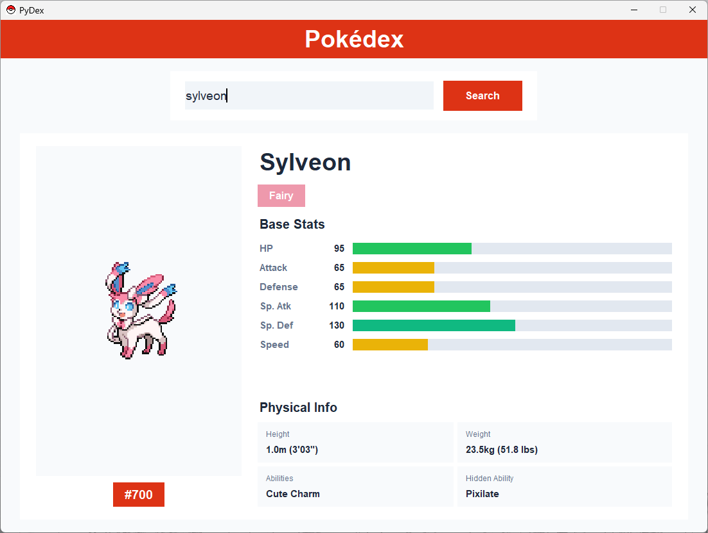
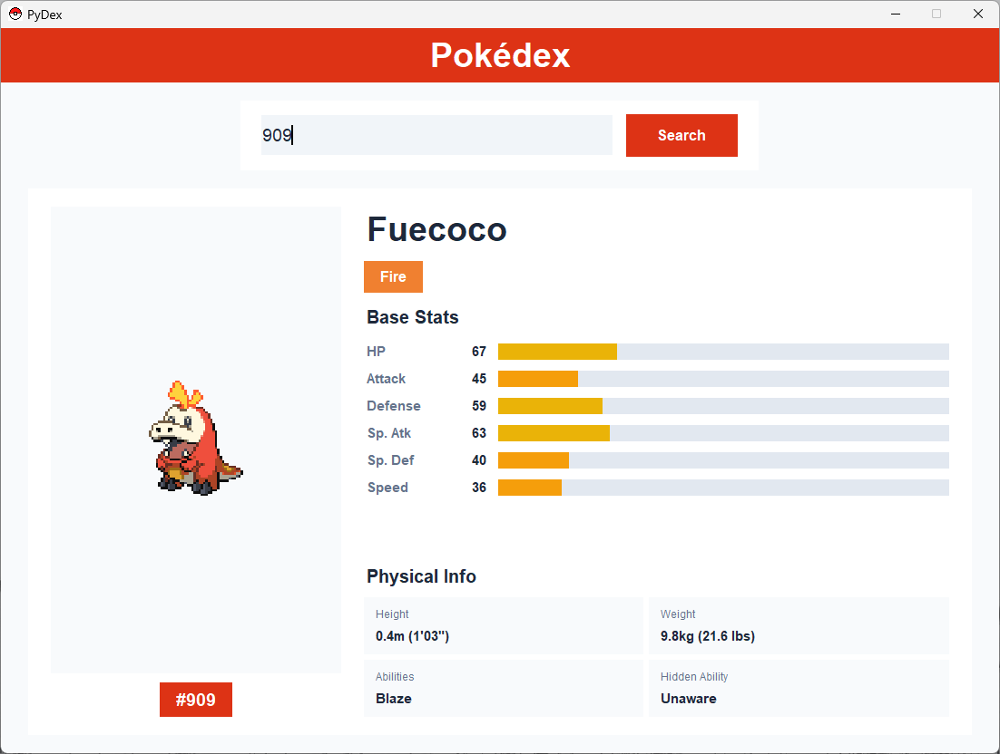

# PyDex: A Command-Line Pokedex

PyDex is a simple, easy-to-use Python script that lets you look up Pokémon information directly from your terminal. You type in a Pokémon's name, and PyDex fetches data from the free and public PokéAPI to display its stats, type, and more.

PyDex also includes a modern graphical user interface (GUI) for those who prefer a visual experience.

## Features

- Look up any Pokémon by name or ID number
- Display basic information including name, Pokédex number, and types
- View base stats with color-coded bars
- See height, weight, abilities, and hidden abilities
- Clean, simple command-line interface
- Modern GUI with pokeball icon and visual Pokémon sprites
- Uses the free PokéAPI (no API key required)

### GUI Screenshots






## Getting Started

### Prerequisites

- Python 3.6 or higher
- pip (Python package installer)

### Installation

1. **Fork this repository** by clicking the "Fork" button in the top right corner of this page.

2. **Clone your fork to your local machine:**
   ```bash
   git clone https://github.com/SthembisoMfusi/PyDex.git
   cd PyDex
   ```

3. **Create a virtual environment (recommended):**
   ```bash
   python -m venv venv
   source venv/bin/activate  # On Windows: venv\Scripts\activate
   ```

4. **Install the necessary dependencies:**
   ```bash
   pip install -r requirements.txt
   ```

### Usage

Run the Pokedex with a Pokémon name:

```bash
# Make sure your virtual environment is activated
source venv/bin/activate  # On Windows: venv\Scripts\activate

# Run the command-line Pokedex
python pokedex.py pikachu

# Or run the GUI version
python pokedex_gui.py
```

**Example Output:**
```
Name: Pikachu
National Pokédex Number: 25
Type(s): Electric
```

## Contributing

We welcome contributions from beginners! This project is specifically designed to help people learn how to contribute to open source projects.

### How to Contribute

1. **Find an issue** you want to work on (look for issues labeled `good first issue` and `hackathon`)
2. **Fork the repository** (if you haven't already)
3. **Clone your fork** to your local machine
4. **Create a new branch** for your feature: `git checkout -b my-new-feature`
5. **Make your changes** and test them
6. **Commit your changes**: `git commit -am 'Add some feature'`
7. **Push to the branch**: `git push origin my-new-feature`
8. **Create a new Pull Request**

For detailed instructions, see our [CONTRIBUTING.md](CONTRIBUTING.md) file.

### Good First Issues

We have several beginner-friendly issues available:

- **Display & Content**: Add height/weight display, abilities, styling improvements
- **Features & Functionality**: Random Pokémon flag, search by number, base stats, colors
- **Robustness & Refactoring**: Better error handling, code organization, CLI improvements

## Technology Stack

- **Language**: Python 3
- **Key Libraries**: `requests` (for HTTP requests), `pillow` (for image processing in GUI)
- **API**: [PokéAPI (v2)](https://pokeapi.co/) - Free, public API with no authentication required

## License

This project is open source and available under the [MIT License](LICENSE).

## Acknowledgments

- Thanks to [PokéAPI](https://pokeapi.co/) for providing the free Pokémon data
- Inspired by the original Pokédex from the Pokémon games